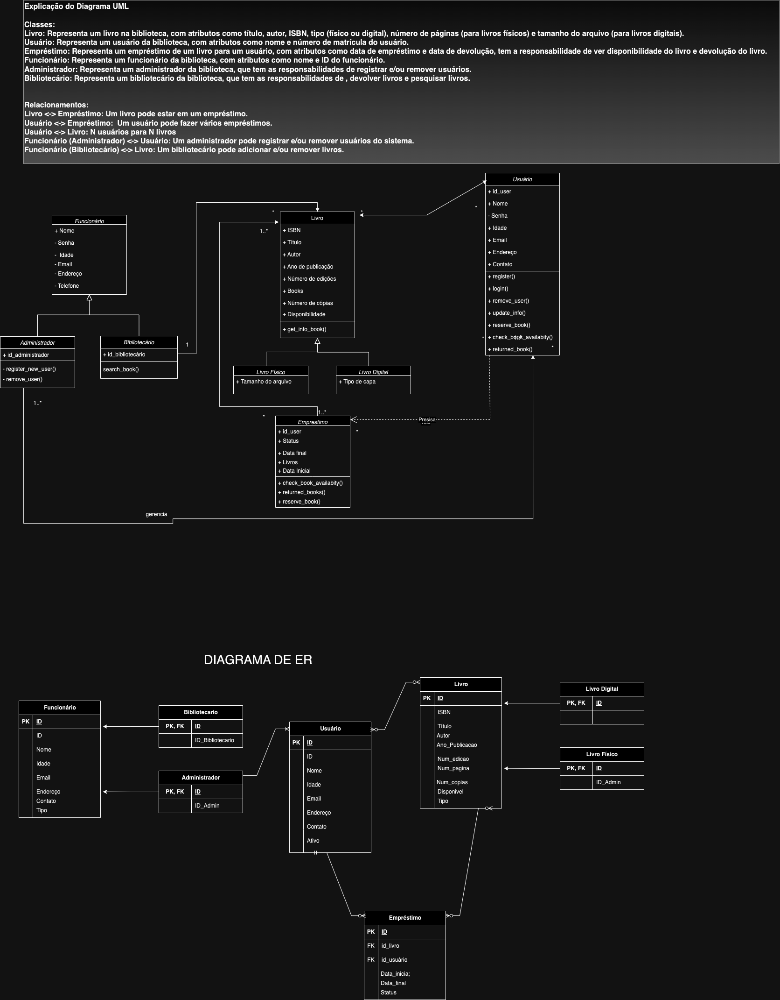

# Documentação do Sistema

## Estrutura de Arquivos
.
├── cli.py
├── db.py
├── library.db
├── user.py
├── employee.py
├── books.py
└── borrow.py

### Arquivos Python

1. *cli.py*
   - *Descrição*: Este arquivo contém a interface de linha de comando (CLI) para interação com o sistema.
   - *Principais Funcionalidades*:
     - Inicialização do sistema.
     - Manipulação de comandos do sistema de biblioteca.
     - Encerramento do sistema.

2. *db.py*
   - *Descrição*: Este arquivo gerencia a conexão e operações com o banco de dados.
   - *Principais Funcionalidades*:
     - Conexão ao banco de dados.
     - Execução de consultas SQL.
     - Criar, deletar estruta e dados das tabelas.

3. *user.py*
   - *Descrição*: Este arquivo lida com as operações relacionadas aos usuários do sistema.
   - *Principais Funcionalidades*:
     - Logar no sistema
     - Criação de novos usuários.
     - Registar novos usuários.
     - Fazer empréstimos de livros.

4. *employee.py*
   - *Descrição*: Este arquivo lida com as operações relacionadas aos funcionários da biblioteca.
   - *Principais Funcionalidades*:
     - Registro de novos funcionários.
     - Gerenciamento de permissões de funcionários(Administrador e Bibliotecário).

5. *books.py*
   - *Descrição*: Este arquivo gerencia as operações relacionadas aos livros no sistema.
   - *Principais Funcionalidades*:
     - Adição de novos livros.

6. *borrow.py*
   - *Descrição*: Este arquivo gerencia o processo de empréstimo de livros.
   - *Principais Funcionalidades*:
     - Registro de empréstimos de livros.
     - Controle de devoluções.
     - Monitoramento de prazos de empréstimos.
     - Controle feito pelos funcionários.

### Arquivos de Banco de Dados

1. *library.db*
   - *Descrição*: Este é o arquivo de banco de dados SQLite3 que armazena todas as informações relacionadas ao sistema, incluindo dados de usuários, funcionários, livros e empréstimos.
   - *Tabelas Principais*:
     - Usuários
     - Funcionários
         *SubClasses*:
          - Administrador
          - Bibliotecario
     - Livros
        *SubClasses*:
          - LivroFísico
          - LivroDigital
     - Empréstimos
    

## Diagrama UML

## Como Utilizar

### Inicialização do Sistema

Para iniciar o sistema, execute o arquivo cli.py:

python cli.py

## Contribuindo

Se você deseja contribuir com o desenvolvimento deste sistema, siga os seguintes passos:

1. Faça um fork do repositório.
2. Crie uma nova branch com a sua feature (git checkout -b minha-nova-feature).
3. Commit suas mudanças (git commit -am 'Adiciona nova feature').
4. Faça push para a branch (git push origin minha-nova-feature).
5. Abra um Pull Request.